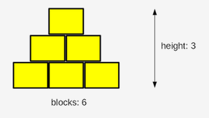

# Python Institue (PCEP) exercices

### Some exercices from Python Essentials Part1
<br />
ref: https://edube.org/


---


## Operators And Expressions
<br />
ref. https://edube.org/learn/pe-1/lab-operators-and-expressions-11
Estimated time

15-20 minutes
Level of diffi.7culty

Easy
Objectives

    improving the ability to use numbers, operators, and arithmetic operations in Python;
    using the print() function's formatting capabilities;
    learning to express everyday-life phenomena in terms of programming language.


### Scenario

Your task is to prepare a simple code able to evaluate the **end time** of a period of time, given as a number of minutes (it could be arbitrarily large). The start time is given as a pair of hours (0..23) and minutes (0..59). The result has to be printed to the console.

For example, if an event starts at **12:17** and lasts **59 minutes**, it will end at **13:16**.

Don't worry about any imperfections in your code - it's okay if it accepts an invalid time - the most important thing is that the code produce valid results for valid input data.

Test your code carefully. Hint: using the `%` operator may be the key to success.

### CODE
``` python

hour = int(input("Starting time (hours): "))
mins = int(input("Starting time (minutes): "))
dura = int(input("Event duration (minutes): "))

time_hour = (hour+dura//60 + (mins+dura%60)//60)%24
time_min = (mins+dura%60)%60
print("It will end at " + str(time_hour) + ":" + str(time_min))

```
---
<br />

## Break and Continue

ref. https://edube.org/learn/pe-1/lab-the-break-statement-stuck-in-a-loop-3


Estimated time

10-20 minutes
Level of difficulty

Easy
Objectives

Familiarize the student with:

    using the break statement in loops;
    reflecting real-life situations in computer code.

### Scenario

The break statement is used to exit/terminate a loop.

Design a program that uses a while loop and continuously asks the user to enter a word unless the user enters "chupacabra" as the secret exit word, in which case the message "You've successfully left the loop." should be printed to the screen, and the loop should terminate.

Don't print any of the words entered by the user. Use the concept of conditional execution and the break statement.

q
``` python
secret = "chupacabra" 
counter = 0
while True:
    word = str(input("Enter a word: "))
    if word == secret:
        break
    counter += 1
    print("Looooooping.", counter)
print("You've successfully left the loop.")

```
---
<br />

## The Continue Statement The Ugly Vowel Eater
ref. https://edube.org/learn/pe-1/lab-the-continue-statement-the-ugly-vowel-eater-3

Estimated time

10-20 minutes
Level of difficulty

Easy
Objectives

Familiarize the student with:

    using the continue statement in loops;
    reflecting real-life situations in computer code.

### Scenario

The continue statement is used to skip the current block and move ahead to the next iteration, without executing the statements inside the loop.

It can be used with both the while and for loops.

Your task here is very special: you must design a vowel eater! Write a program that uses:

a for loop;
the concept of conditional execution (if-elif-else)
the continue statement.

Your program must:

Ask the user to enter a word;\
Use user_word = _user_word.upper()_ to convert the word entered by the user to upper case;\
We'll talk about the so-called string methods and the upper() method very soon - don't worry;

Use conditional execution and the continue statement to "eat" the following vowels A, E, I, O, U from the inputted word;
print the uneaten letters to the screen, each one of them on a separate line.

Test your program with the data we've provided for you.

Test data

Sample input: Gregory
```
Expected output:
GRGRY
```
Sample input: abstemious
``` 
Expected output:
BSTMS
```
Sample input: IOUEA
```
Expected output:
??
```
### CODE

```python
#!/bin/usr/env python3

word_without_vowels = ""

# Prompt the user to enter a word
# and assign it to the user_word variable.
user_word = str(input("Enter a Word:"))
user_word = user_word.upper()
for letter in user_word:
    # Complete the body of the loop.
    if letter == "A":
        continue
    elif letter == "E":
        continue
    elif letter == "I":
        continue
    elif letter == "O":
        continue
    elif letter == "U":
        continue
    else:
        word_without_vowels += letter
    
# Print the word assigned to word_without_vowels.
print(word_without_vowels)

```


## 3.2.1.14 LAB: Essentials of the while loop

ref.: https://edube.org/learn/pe-1/lab-essentials-of-the-while-loop-3

Estimated time
20-30 minutes
Level of difficulty Medium

### Objectives

_Familiarize the student with:_

    using the while loop;
    finding the proper implementation of verbally defined rules;
    reflecting real-life situations in computer code.

### Scenario

Listen to this story: a boy and his father, a computer programmer, are playing with wooden blocks. They are building a pyramid.

Their pyramid is a bit weird, as it is actually a pyramid-shaped wall - it's flat. The pyramid is stacked according to one simple principle: each lower layer contains one block more than the layer above.

The figure illustrates the rule used by the builders:




Your task is to write a program which reads the number of blocks the builders have, and outputs the height of the pyramid that can be built using these blocks.

Note: the height is measured by the number of fully completed layers - if the builders don't have a sufficient number of blocks and cannot complete the next layer, they finish their work immediately.

Test your code using the data we've provided.

Test Data

Sample input: 6

Expected output: The height of the pyramid: 3

Sample input: 20

Expected output: The height of the pyramid: 5

Sample input: 1000

Expected output: The height of the pyramid: 44

Sample input: 2

Expected output: The height of the pyramid: 1


``` python
blocks = int(input("Enter the number of blocks: "))

#
# Write your code here.
#	

height = 0

inlayer = 1

while inlayer <= blocks:

    height += 1
    blocks -= inlayer
    print("blocks: ",blocks)
    inlayer += 1
    print("inlayer: ",inlayer)

print("The height of the pyramid:", height)
```
``` python
Enter the number of blocks: 6

blocks:  5

inlayer:  2

blocks:  3

inlayer:  3

blocks:  0

inlayer:  4

The height of the pyramid: 3

```